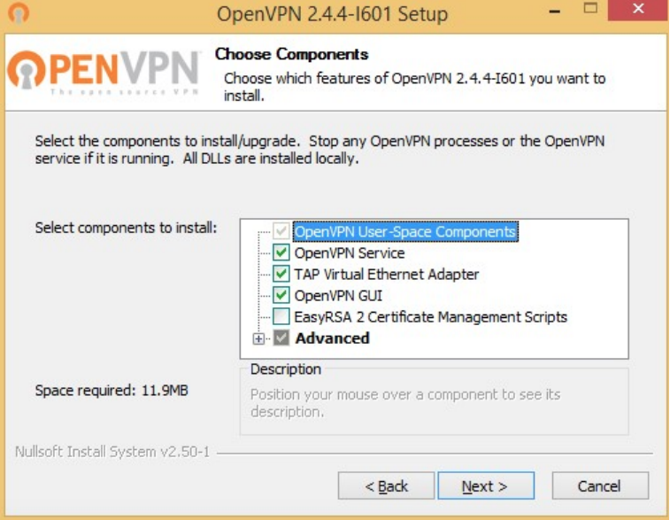
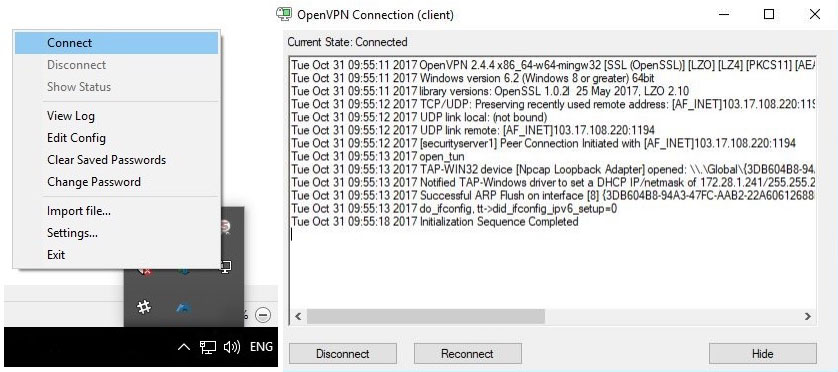

2. Системд холбогдох
=====================

2.1 “Windows” үйлдлийн системээс холбогдох
-------------------------------------------

| 	2.1.1 Дараах холбоосоор орж “OpenVPN” хэрэглэгчийн програмыг татаж суулгана. https://swupdate.openvpn.org/community/releases/openvpn-install-2.4.4-I601.exe. Татаж авсан хэрэглэгчийн програмыг суулгахдаа дараах бүрэлдэхүүн хэсгийг идэвхжүүлэн суулгана.

.. centered:: Зураг 2. OpenVpn програмын бүрэлдэхүүн хэсгүүд

| 	2.1.2 Хэрэглэгчийн програмыг амжилттай суулгасны дараа програмыг ачаалахад систем дээр C:\Users\your user name\OpenVPN\config хавтас үүснэ. Тус хавтас дотор Үндэсний дата төвөөс өгсөн тохиргооны файл, гэрчилгээ болон бусад файлуудыг хуулна.

.. centered:: Зураг 3. OpenVpn програмаар холбогдох

| 	2.1.3 Тохиргооны файлыг хуулсны дараа дэлгэцний баруун доод буланд байрлах “OpenVPN GUI” дээр хулганы баруун товчийг даран “connect” сонгон холбогдоно.

| 	2.1.4 C:\Windows\System32\drivers\etc\hosts файлд дараах бичилтийг хийх. x.x.x.x xyp.gov.mn

2.2 “Linux” үйлдлийн системээс холбогдох
-----------------------------------------

| 	2.2.1 “OpenVPN” хэрэглэгчийн програм суулгах

.. code-block:: bash

   #Fedora/CentOS/RedHat
   yum install openvpn
   #Ubuntu/Debian
   apt-get install openvpn

| 	2.2.2 Хэрэглэгчийн програмыг амжилттай суулгасны дараа “/etc/openvpn” хавтас үүснэ. Тус хавтас дотор Үндэсний дата төвөөс өгсөн тохиргооны файл, гэрчилгээ болон бусад файлуудыг хуулна.

|	2.2.3 Тохиргооны файлд дараах өөрчлөлтийг хийнэ.

.. code-block:: bash

   #Fedora/CentOS/RedHat
	mv /etc/openvpn/client.ovpn /etc/openvpn/client.conf
	rpm -ql openvpn | grep service
	#Ubuntu/Debian
	mv /etc/openvpn/client.ovpn /etc/openvpn/client.conf

|	2.2.4. “VPN” сүлжээнд холбогдох

.. code-block:: bash

   systemctl start openvpn@client

|	2.2.5. “/etc/hosts” файлд дараах бичилтийг хийнэ. x.x.x.x xyp.gov.mn

.. note:: x.x.x.x ip хаяг гэрээ байгуулсны дараа олгоно